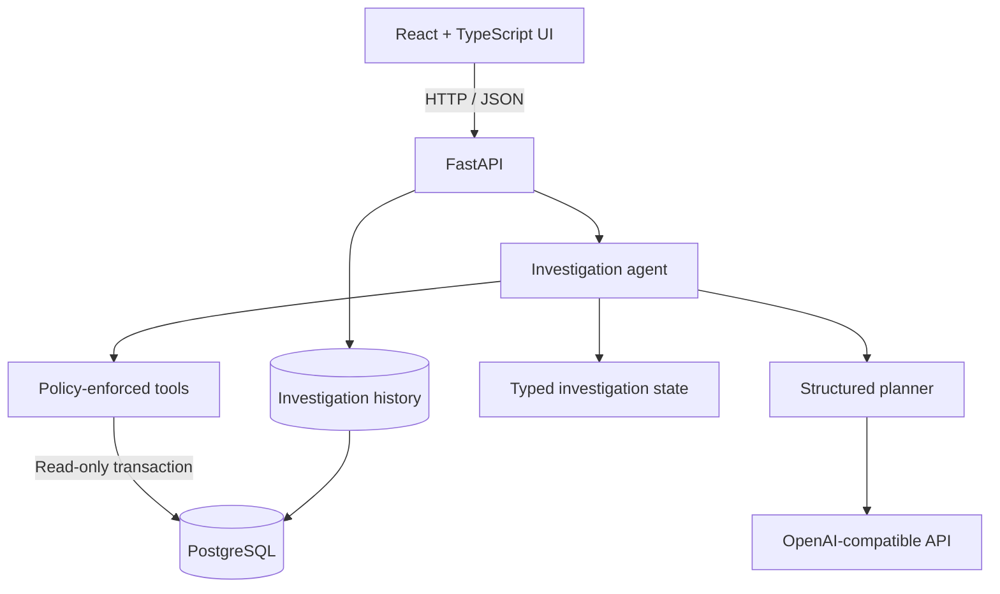

<<<<<<< HEAD
# db-investigator-ai
=======
# DB Investigator AI

DB Investigator AI is an evidence-driven PostgreSQL investigation agent. Give it a performance
symptom, a SQL query, or both. It inspects the live schema, indexes, statistics, and query plans;
tests hypotheses with read-only tools; and produces a structured report that separates observed
facts from recommendations.

This is an investigation workflow rather than a chat interface. The model must use database tools
before it can finish, every tool call is recorded, and the final report can only be produced after
the agent has collected evidence.

> **Screenshot placeholder:** Add the main workspace and completed-report screenshots to
> `docs/screenshots/` after running a configured investigation. Suggested captures are listed in
> [Screenshots](#screenshots).

## Why I built it

Database advice from a language model is easy to generate and difficult to trust. Useful database
engineering starts with the actual schema and execution plan. I built this project to explore an
agent design in which model decisions are constrained by application-owned tools, claims are tied
to observed PostgreSQL output, and unvalidated recommendations are labeled honestly.

## Architecture



The browser never connects to PostgreSQL or the model provider. FastAPI owns both connections and
persists the public activity timeline and final report. The provider receives sanitized tool output,
never database credentials. SQL validation and transaction restrictions run in application code,
outside the model's control.

More detail is available in [docs/architecture.md](docs/architecture.md).

## Agent workflow

1. Parse the submitted problem and optional query into typed investigation state.
2. Ask the structured planner for one next action.
3. Validate the requested tool name and arguments in Python.
4. Execute the tool inside a read-only PostgreSQL transaction with a statement timeout.
5. Add the observed result to evidence and update hypotheses.
6. Continue until the model returns an evidence-backed report or reaches the iteration limit.
7. Persist the report or a sanitized failure and expose it through the API and UI.

The activity timeline shows concise action summaries and tool results. It does not display private
chain-of-thought.

## Technology stack

- React 19, TypeScript, and Vite
- Python 3.12, FastAPI, and Pydantic
- psycopg 3 and PostgreSQL 16
- SQLGlot for structural SQL validation
- Docker and Docker Compose
- pytest with a real PostgreSQL integration test
- Any provider exposing an OpenAI-compatible chat-completions endpoint

## Database tools

| Tool | Purpose |
| --- | --- |
| `list_tables` | Discover user tables outside PostgreSQL system schemas. |
| `describe_table` | Inspect column names, types, defaults, and nullability. |
| `list_indexes` | Read the definitions of indexes on a table. |
| `get_table_statistics` | Inspect row estimates, dead rows, scans, analysis times, and table size. |
| `execute_readonly_query` | Execute one validated `SELECT` and return a bounded result. |
| `explain_query` | Obtain a JSON estimated plan without executing the query. |
| `explain_analyze_query` | Execute a validated read-only query and obtain measured plan evidence. |
| `inspect_query_plan` | Extract scans, sorts, joins, timing, and cardinality mismatches from a plan. |
| `get_database_version` | Record the PostgreSQL version under investigation. |

## Safety design

- Credentials come from environment variables and are never placed in model messages.
- SQL is parsed as PostgreSQL syntax. Only a single `SELECT`, set operation, or read-only CTE is
  accepted.
- DML, DDL, `SELECT INTO`, row locks, multiple statements, and known side-effecting PostgreSQL
  functions are rejected before reaching the database.
- Every diagnostic query runs in a transaction declared `READ ONLY`.
- PostgreSQL enforces a configurable per-transaction statement timeout.
- Returned rows are capped independently of the query text.
- Tool names and arguments are validated against a fixed registry.
- Every invocation logs its tool name, duration, outcome, row count, and truncation state. SQL text
  and credentials are omitted from structured logs.
- The investigation loop has a configurable step limit and refuses to finish without tool evidence.

Read-only transactions are an additional database control, not a replacement for least-privilege
credentials. For an external database, use an account restricted to the schemas and views that the
agent is allowed to inspect.

## Installation

Requirements:

- Docker Engine with Docker Compose v2
- An API key and model name for an OpenAI-compatible provider

Clone the repository and create the local environment file:

```bash
git clone <your-repository-url> db-investigator-ai
cd db-investigator-ai
cp .env.example .env
```

Set the three LLM values in `.env`, then start the stack:

```bash
docker compose up --build
```

Open <http://localhost:5173>. The backend API is also available at
<http://localhost:8000/docs>.

The first database startup creates the schema and generates the deterministic demo dataset. Docker
stores it in the `postgres_data` volume, so later starts do not reseed it.

## Environment variables

| Variable | Required | Default | Description |
| --- | --- | --- | --- |
| `LLM_API_KEY` | Yes | empty | API key sent only to the configured model endpoint. |
| `LLM_BASE_URL` | Yes | empty | Base URL of an OpenAI-compatible API, usually ending in `/v1`. |
| `LLM_MODEL` | Yes | empty | Provider-specific model identifier. |
| `POSTGRES_DB` | No | `db_investigator` | Demo database name. |
| `POSTGRES_USER` | No | `investigator` | Demo database user. |
| `POSTGRES_PASSWORD` | No | `change-me` | Local demo password; change it outside local development. |
| `DATABASE_URL` | No | Compose service URL | psycopg connection string used by the backend. |
| `DB_STATEMENT_TIMEOUT_MS` | No | `10000` | Maximum database statement duration. |
| `DB_MAX_ROWS` | No | `200` | Maximum rows returned from a query tool. |
| `AGENT_MAX_ITERATIONS` | No | `12` | Maximum planner actions in one investigation. |

The project does not infer a provider. All three `LLM_*` variables must be configured before a real
investigation can run.

## Running locally

```bash
# Start and rebuild all services
make up

# Follow service logs
make logs

# Stop containers while retaining demo data
make down

# Remove containers and the demo-data volume
docker compose down --volumes
```

Health and database checks:

```bash
curl http://localhost:8000/health
curl http://localhost:8000/api/database/status
```

Start an investigation without the UI:

```bash
curl -X POST http://localhost:8000/api/investigate \
  -H 'Content-Type: application/json' \
  -d '{
    "problem": "Customer order history is slow as the table grows.",
    "sql": "SELECT id, status, total_cents, created_at FROM orders WHERE user_id = 1544 ORDER BY created_at DESC LIMIT 25"
  }'
```

Use the returned `id` with `GET /api/investigations/{id}` to read progress and the final report.

## Example investigation

The seeded order-history scenario asks the agent to investigate:

```sql
SELECT id, status, total_cents, created_at
FROM orders
WHERE user_id = 1544
ORDER BY created_at DESC
LIMIT 25;
```

In the verified demo database, `EXPLAIN ANALYZE` observed a sequential scan of 100,000 orders, five
matching rows, 99,995 rows removed by the filter, and a separate sort. Those are database facts the
agent can use to form an index hypothesis. A completed report should still distinguish that baseline
from any after-state: this project does not create a real index automatically, and it must not invent
an improvement measurement.

Three ready-to-use prompts and queries are documented in
[docs/demo-scenarios.md](docs/demo-scenarios.md).

## Testing

The suite uses a deterministic mock model provider. It does not require a paid model API.

```bash
make test
```

The test Compose profile builds an isolated Python test image, waits for PostgreSQL to become
healthy, and runs:

- SQL safety and destructive-query rejection tests
- query-plan inspection tests
- structured provider tests with an in-memory HTTP transport
- agent loop and state-transition tests
- FastAPI endpoint and persisted mock-investigation tests
- a live PostgreSQL database-tool integration test

Frontend verification:

```bash
cd frontend
npm ci
npm run build
npm run lint
npm audit
```

## Project structure

```text
db-investigator-ai/
├── backend/
│   ├── app/
│   │   ├── agent/          # loop, planner, prompts, state, report, tools
│   │   ├── llm/            # provider abstraction and deterministic mock
│   │   ├── database.py     # connection pool and read-only transactions
│   │   ├── main.py         # FastAPI routes and background execution
│   │   ├── models.py       # public request and response contracts
│   │   └── repository.py   # investigation persistence
│   ├── Dockerfile
│   └── pyproject.toml
├── database/init/          # schema and deterministic seed generator
├── docs/                   # architecture and demo scenarios
├── frontend/src/           # React investigation workspace
├── tests/                  # unit, API, agent, and PostgreSQL tests
├── .env.example
├── docker-compose.yml
└── README.md
```

## API

- `GET /health` — process health
- `GET /api/database/status` — live PostgreSQL connectivity and version
- `POST /api/investigate` — persist and queue an investigation
- `GET /api/investigations/{id}` — read status, activity, tool output, and report

FastAPI generates the complete OpenAPI contract at `/docs` while the backend is running.

## Screenshots

For a public repository or portfolio, capture:

1. The initial workspace at 1440 px wide, showing the connected database and input form.
2. An investigation in progress with at least three timeline actions and one expanded tool result.
3. A completed report showing evidence, root cause, recommendation, confidence, and SQL.
4. A narrow mobile viewport showing the stacked input and timeline layout.
5. The FastAPI `/docs` page with the four public endpoints.

Use a real completed run and keep API keys, connection strings, hostnames, and unrelated browser
content out of the images.

## Current limitations

- A configured external model provider is required for interactive investigations; automated tests
  use the included mock provider.
- Investigations run as in-process FastAPI background tasks. A process restart can interrupt an
  active run, although its persisted history remains available.
- Index recommendations are reported but not applied. Without a hypothetical-index extension, an
  index recommendation cannot produce measured after-state evidence automatically.
- SQL validation reduces risk but is not a full PostgreSQL authorization system. External database
  access should use a dedicated least-privilege role.
- The UI polls for progress and currently shows one investigation at a time.
- The demo seed is designed for local investigation behavior, not load or concurrency benchmarking.

## Future improvements

- Durable job execution with retries and restart recovery
- Server-sent events for lower-latency activity updates
- Hypothetical-index evaluation through HypoPG
- Separate diagnostic and persistence database roles
- Schema allowlists and per-user connection profiles
- Investigation history browsing and report export
- Token and cost telemetry with provider-specific adapters
- Evaluation fixtures that grade evidence citation and hypothesis rejection

## License

Released under the [MIT License](LICENSE).

>>>>>>> 95a93ab (DB investigator AI)
