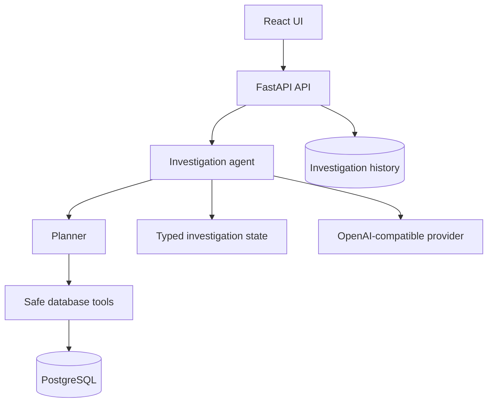

# Architecture

DB Investigator AI separates orchestration from database access. The agent can only interact
with PostgreSQL through registered, policy-enforced diagnostic tools. Tool results become typed
evidence in investigation state and are later cited in the final report.

## Trust boundaries

- The browser submits a problem description and optional SQL, then displays sanitized events.
- The API owns persistence, model access, and database access.
- The model receives tool schemas and sanitized observations, never database credentials.
- The database layer independently validates SQL and enforces read-only transactions, timeouts,
  and result limits. Model instructions cannot bypass these controls.

